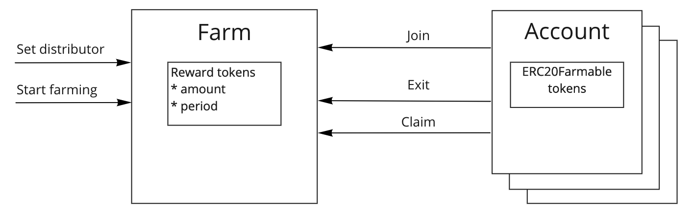
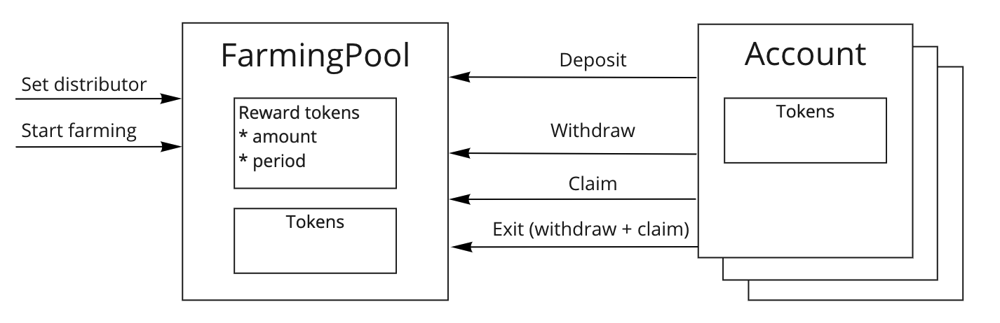

<div align="center">
    
    
</div>

# Farming contracts

# _**!!! NOTICE: WAIT UNTILL FULLY AUDITED !!!**_


[](https://github.com/1inch/farming/actions)
[](https://coveralls.io/github/1inch/farming?branch=master)

# Overview

## About

1inch farming contract offers protocols to give rewards to users holding specific tokens. The repository offers two ways to get rewards

- A user can hold `ERC20Farmable` token on its account without staking or depositing it to any contract. User should join a farm and hold tokens on its account to get rewards.
- A user can stake/deposit specific tokens to `FarmingPool` smart contract. It is less convenient way and is only used for backward compatibility for those smart contracts that have been deployed and there are no way to change it.

## Math

Farming reward is distributed uniformly across the whole farming period and depends on number of participants. Actually, the reward is a piecewise linear function which is set by formula

$$
R_p= \sum{ R \ * \frac {t}{T} *\ \frac {V}{V_{total}} }
$$

where $R_p$ - total farming reward for a farming participant

*R* - total reward locked for farming

*t* - time period duration (between farm’s joins and/or exits) 

*T* - total farming duration

*V* - participant’s farmable tokens share

$V_{total}$ - total number of farmable tokens joined the farm

## Example

Given $72 000 reward is locked for 5 weeks in a farm and there are three farmers

- `Farmer 1` joins at week 1 with 100 farmable tokens on his balance but exits at week 2 and rejoins at week 3. At week 4 he increases his balance up to 200 farmable tokens
- `Farmer 2` joins at week 2 with 300 farmable tokens and exits after week 3
- `Farmer 3` joins at week 2 with 300 farmable tokens but decreases his farmable token balance after week 3 down to 100 and exits at week 4

| 72000$ reward | Week 1 | Week 2 | Week 3 | Week 4 |
| --- | --- | --- | --- | --- |
| Farmer 1 | 100 |  | 100 | 200 |
| Farmer 2 |  | 300 | 300 |  |
| Farmer 3 |  | 300 | 100 |  |

The resulting reward distribution would be the following

|  | Week 1 | Week 2 | Week 3 | Week 4 |
| --- | --- | --- | --- | --- |
| Farmer 1 | 18000 |  | 3600 | 18000 |
| Farmer 2 |  | 9000 | 10800 |  |
| Farmer 3 |  | 9000 | 3600 |  |

More examples are here [@1inch/farming/TESTS.md#deposit](https://github.com/1inch/farming/blob/master/TESTS.md#deposit)

# `ERC20Farmable` and `Farm` usage

## Concept

To start new farming owner should deploy (or use already deployed) farming for a pair of tokens and initialize it.

1. Deploy farm and set farmable and reward token
2. Start farming
    - Set distributor
    - From distributor account send reward amount and set farming period

When farming is started users holding farmable tokens may `join` the farm to accumulate rewards. After joining a farm, a user starts to get farm rewards for the whole amount of farmable tokens he owns. When a user’s balance changes the reward share is changed automatically.

If a user wants to stop participating in farming he should `exit` the farm with. Rewards for previous farming periods may be claimed any time with `claim` function regardless if a user is still farming or has already exited the farm.



A user may join several farms which provide rewards for the same token.

To prevent new farmings from starting an owner may set a distributor address to zero.

## Installation

# _**!!! NOTICE: WAIT UNTILL FULLY AUDITED !!!**_


```bash
$ npm install @1inch/farming
```

or

```bash
$ yarn add @1inch/farming
```

## Usage

Once installed, you can use the contracts in the library by importing them. Just use `ERC20Farmable` instead of `ERC20` to derive from

```solidity
pragma solidity ^0.8.0;

import "@1inch/farming/contracts/ERC20Farmable.sol";

contract AMMPoolToken is ERC20Farmable {
    constructor() ERC20("AMMPoolToken", "AMM") {
    }
}
```

## Optimizations

Storage access:

- [1 storage slot](https://github.com/1inch/farming/blob/master/contracts/accounting/FarmAccounting.sol#L9-L11) for farming params, updated only on farming restarting:
    
    ```solidity
    uint40 public finished;
    uint32 public duration;
    uint184 public reward;
    ```
    
- [1 storage slot](https://github.com/1inch/farming/blob/master/contracts/accounting/UserAccounting.sol#L7-L8) for farming state, updated only on changing number of farming tokens:
    
    ```solidity
    uint40 public checkpoint;
    uint216 public farmedPerTokenStored;
    ```
    
- [1 storage slot](https://github.com/1inch/farming/blob/master/contracts/accounting/UserAccounting.sol#L9) per each farmer, updated on deposits/withdrawals (kudos to [@snjax](https://github.com/snjax)):
    
    `mapping(address => int256) public corrections;`
    
- Compact address array is used for storing farms per user/wallet. Array length is stored in high bits of the first array item:
    - [@1inch/solidity-utils/AddressArray.sol](https://github.com/1inch/solidity-utils/blob/master/contracts/libraries/AddressArray.sol)

# `FarmingPool` usage

The `FarmingPool` usage is almost the same but a farmer has to deposit farmable tokens to farm account and withdraw it after the farming is completed.

